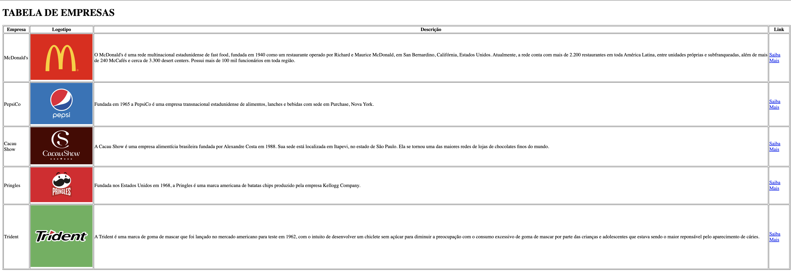

# Tabela-2024

---
## Sobre
Tabela para descrever marcas de empresas. O intuito deste projeto é colocar em prática o conhecimento adquirido sobre as linguagens de marcação, HTML, CSS e Markdown, no curso Técnico de Desenvolvimento de Sistemas do [SENAI JANDIRA](https://sp.senai.br/unidade/jandira/).

---
## Tecnologias utilizadas
- HTML
- CSS
- Markdown
- Git

---
## Autor
[Laura Sofia](https://www.linkedin.com/in/laura-sofia-0a5b06326/?trk=opento_sprofile_topcard)